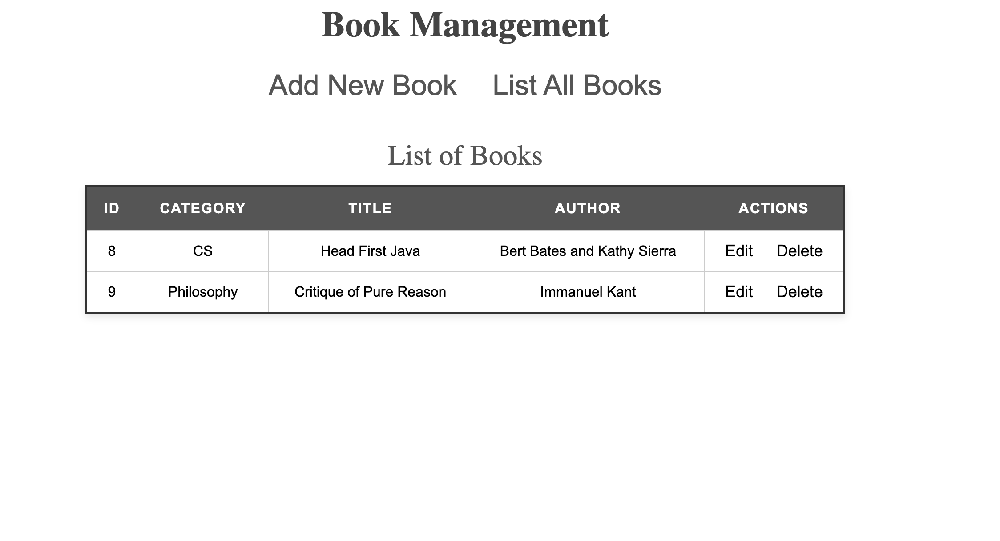
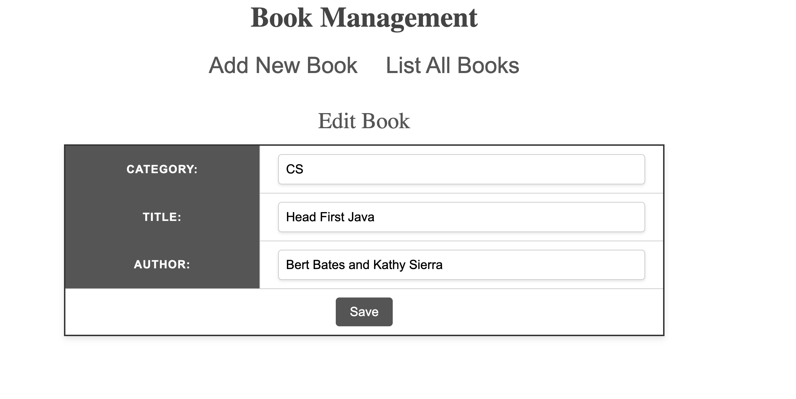

# Book Management Application
A simple web application for managing books using Java, JSP, Servlets, and JDBC. It basically is a clone of this tutorial: "https://www.codejava.net/coding/jsp-servlet-jdbc-mysql-create-read-update-delete-crud-example"

The Preview: 

